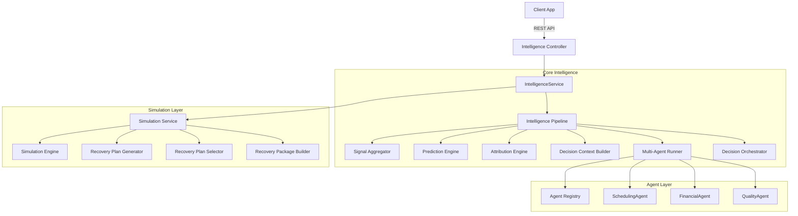

# Construction IQ Architecture

## Overview
Construction IQ is designed as a modular monolith backend. The system integrates machine learning predictions, specialized multi-agent analysis, and simulation to provide end-to-end intelligence for construction projects.

## Architecture Diagram


## Request Lifecycle
1. **API Layer:** `IntelligenceController` receives a request and validates it using Zod schemas (`runFullSchema`, `runPredictionSchema`, etc.).
2. **Orchestration:** `IntelligenceService` coordinates the overall flow. It decides whether to run a full pipeline, just a prediction, or just a decision.
3. **Pipeline Layer:** `IntelligencePipeline` executes standard intelligence phases:
   - **Signal Aggregation:** Collects `Project`, `RiskEvent`, `Predictions`, and `PublicSignals`.
   - **Prediction & Attribution:** Generates predictive scores and root cause analysis.
   - **Agent Runner:** Dispatches specialized context subsets to Financial, Scheduling, and Quality agents.
   - **Decision Orchestrator:** Resolves conflicting agent recommendations using deterministic rules.
4. **Simulation Layer:** `SimulationService` takes the final `DecisionPackage`, runs scenarios using the `SimulationEngine`, and selects the optimal `RecoveryPlan`.
5. **Response:** The completed `RecoveryPackage` (or partial payload, if requested) is returned to the client, logging unresolvable conflicts for human review.

## Module Responsibilities
- **api/src/modules/intelligence:** Core orchestration, pipeline logic, API endpoints, and DTO validation.
- **api/src/modules/agents:** Multi-agent runtime, individual specialized agents, and response formatters.
- **api/src/modules/simulation:** Monte-Carlo-style simulation, recovery plan generation, and optimization.
- **api/src/services/ai:** Abstracted AI provider integration (OpenAI, Anthropic, Gemini).
- **api/src/config/env.ts:** Centralized, strictly-typed configuration logic.

## Dependency Boundaries
- The **Simulation Layer** strictly depends on the **Intelligence Layer**'s output (`DecisionPackage`). The reverse is explicitly forbidden to prevent circular dependencies.
- **Controllers** depend on **Services**, not directly on internal Engines or Workers.
- All AI invocations must use the `ProviderFactory` abstract layer. Direct vendor API calling inside business logic is disallowed.

## Folder Structure
```text
apps/api/
├── prisma/                 # Database schema and migrations
├── src/
│   ├── config/             # Typed environment configs
│   ├── middleware/         # Auth, Security, Error handlers
│   ├── modules/
│   │   ├── auth/           # Authentication endpoints
│   │   ├── intelligence/   # Intelligence orchestration, pipelines & API
│   │   ├── agents/         # Multi-Agent layer
│   │   ├── simulation/     # Simulation engine
│   │   └── projects/       # Core domain entities
│   ├── queues/             # BullMQ definitions
│   ├── services/           # Shared AI & Notification services
│   ├── utils/              # Loggers, Telemetry helpers
│   └── workers/            # BullMQ background processors
└── package.json
```
